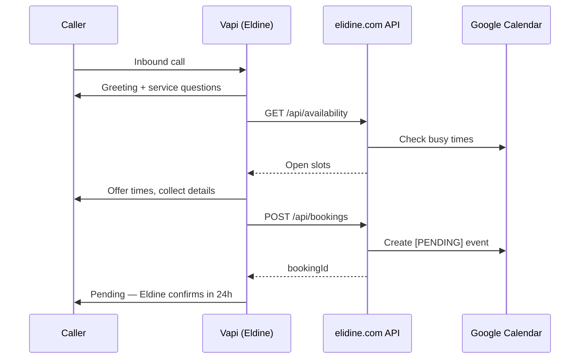

# Vapi Voice Agent Setup — Elidine

Phone bookings run through **Vapi**. Callers dial **(929) 202-9714** and speak with the **Eldine** assistant, which can check live availability and submit pending booking requests to the Elidine API.

## Current configuration

| Resource | ID / value |
|----------|------------|
| Assistant | **Eldine** — `6e3b77b0-9bca-4acd-997b-b0d1d8ea9620` |
| Main phone | **+1 (929) 202-9714** — `75c158b6-05ea-4a47-bdd8-4974afc02361` |
| Tool: check_availability | `1f9e0c72-ed66-4764-899c-d36d8c3f9713` |
| Tool: submit_booking | `0f54e4b0-7dec-457f-9395-f76251da7515` |
| Dashboard | https://dashboard.vapi.ai |

## Environment variables

Add to `.env.local` (local) and Vercel (production):

| Variable | Description |
|----------|-------------|
| `VAPI_PRIVATE_KEY` | Private API key from Vapi dashboard |
| `VAPI_PUBLIC_KEY` | Public key (for web widget if needed) |
| `VAPI_TOKEN` | Same as private key — used by Cursor MCP |

```bash
VAPI_PRIVATE_KEY=your-private-key
VAPI_PUBLIC_KEY=your-public-key
VAPI_TOKEN=your-private-key
```

## Cursor MCP (manage Vapi from the IDE)

Project MCP config lives at `../.cursor/mcp.json`.

1. Copy the example if needed:
   ```bash
   cp ../.cursor/mcp.json.example ../.cursor/mcp.json
   ```
2. Set `VAPI_TOKEN` in `mcp.json` to your private key (or match `.env.local`).
3. Restart Cursor — you should see `vapi_*` tools available.
4. Use the **vapi** skill at `../.cursor/skills/vapi/SKILL.md` for Elidine-specific workflows.

Alternatively, add to your global `~/.cursor/mcp.json`:

```json
{
  "mcpServers": {
    "vapi": {
      "command": "npx",
      "args": ["-y", "@vapi-ai/mcp-server"],
      "env": { "VAPI_TOKEN": "YOUR_VAPI_PRIVATE_KEY" }
    }
  }
}
```

## How phone booking works



Phone bookings create **pending** calendar events (same as the direct `/api/bookings` path). The website **Book Now** flow uses Stripe for the $50 deposit; mention the deposit policy on calls and follow up for payment if needed.

## API tools wired in Vapi

### check_availability

- **GET** `https://elidine.com/api/availability?date={{date}}&serviceId={{serviceId}}`
- `date`: `YYYY-MM-DD`
- `serviceId`: one of `knotless`, `box`, `goddess`, `fulani`, `cornrows`, `stitch`, `twists`, `faux`, `bridal`, `kids`

### submit_booking

- **POST** `https://elidine.com/api/bookings`
- Required: `serviceId`, `date`, `time`, `firstName`, `email`
- Optional: `lastName`, `phone`, `hairLength`, `hairTexture`, `notes`

## Updating the assistant prompt

The system prompt source of truth is:

```
scripts/vapi-elidine-prompt.txt
```

After editing, push to Vapi:

```bash
export VAPI_TOKEN="your-private-key"
python3 scripts/update-vapi-assistant.py
```

Or use Cursor with the **vapi** skill and `vapi_update_assistant`.

## Testing

1. Call **(929) 202-9714** from your phone
2. Ask to book knotless braids for an upcoming Tuesday
3. Confirm the agent checks availability and collects your details
4. Verify a `[PENDING]` event appears in Google Calendar / admin panel

Review call logs in the [Vapi dashboard](https://dashboard.vapi.ai) or via `vapi_list_calls`.

## Live call streaming

The Eldine assistant has `monitorPlan.listenEnabled` and `monitorPlan.controlEnabled` turned on. Every active call exposes:

- `monitor.listenUrl` — WebSocket stream of live PCM audio
- `monitor.controlUrl` — live call control endpoint

### Admin live monitor

Open `/project/live-calls.html` on your deployed site:

1. Enter your `ADMIN_API_KEY`
2. Active calls refresh every 5 seconds
3. Click **Listen live** to stream the call in your browser

API: `GET /api/admin/live-calls` (requires `X-Admin-Key` header)

## Google Drive archiving

When a call ends, Vapi sends an `end-of-call-report` webhook to `/api/vapi-webhook`. The handler:

1. Downloads the stereo recording from Vapi (authenticated API)
2. Uploads recording, transcript, and metadata JSON to Google Drive

### One-time Drive setup

1. In [Google Drive](https://drive.google.com), create a folder e.g. **Elidine Call Recordings**
2. Copy the folder ID from the URL (`https://drive.google.com/drive/folders/FOLDER_ID`)
3. Open Google Cloud Console → enable **Google Drive API** on the same project as your Calendar service account
4. Share the Drive folder with your service account email (`...@....iam.gserviceaccount.com`) as **Editor**
5. Set env vars:

| Variable | Value |
|----------|-------|
| `GOOGLE_DRIVE_FOLDER_ID` | Folder ID from step 2 |
| `VAPI_WEBHOOK_SECRET` | Random secret (`openssl rand -hex 32`) — must match Vapi assistant `serverUrlSecret` |

6. Deploy, then run:

```bash
export VAPI_TOKEN="your-private-key"
export VAPI_WEBHOOK_SECRET="your-webhook-secret"
export SITE_URL="https://elidine.com"
python3 scripts/update-vapi-assistant.py
```

### Webhook endpoint

| Endpoint | Method | Purpose |
|----------|--------|---------|
| `/api/vapi-webhook` | POST | Receives `end-of-call-report`, archives to Drive |

Vapi sends `X-Vapi-Secret` header when `serverUrlSecret` is configured.

### Files saved per call

- `YYYY-MM-DD-HH-MM-SS_{caller}_{callId}-recording.wav`
- `YYYY-MM-DD-HH-MM-SS_{caller}_{callId}-transcript.txt`
- `YYYY-MM-DD-HH-MM-SS_{caller}_{callId}-metadata.json`

## Related docs

- `BOOKING_SETUP.md` — Google Calendar + admin panel
- `STRIPE_SETUP.md` — website deposit checkout
- `.cursor/skills/vapi/SKILL.md` — Cursor agent skill for Vapi changes
